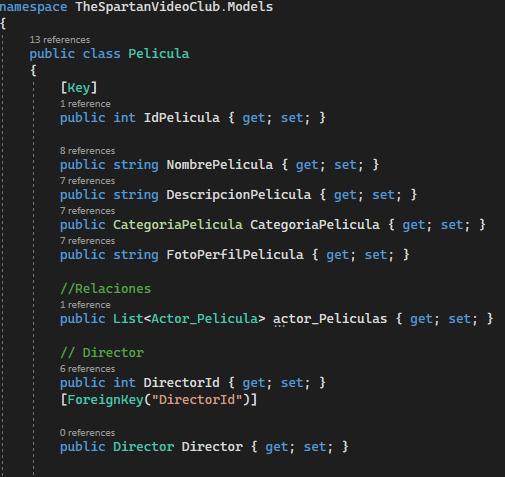
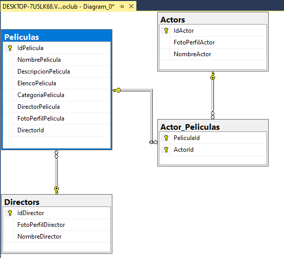
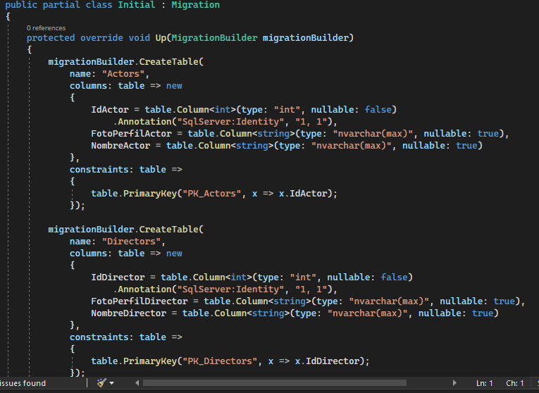
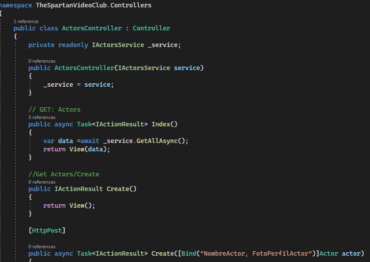
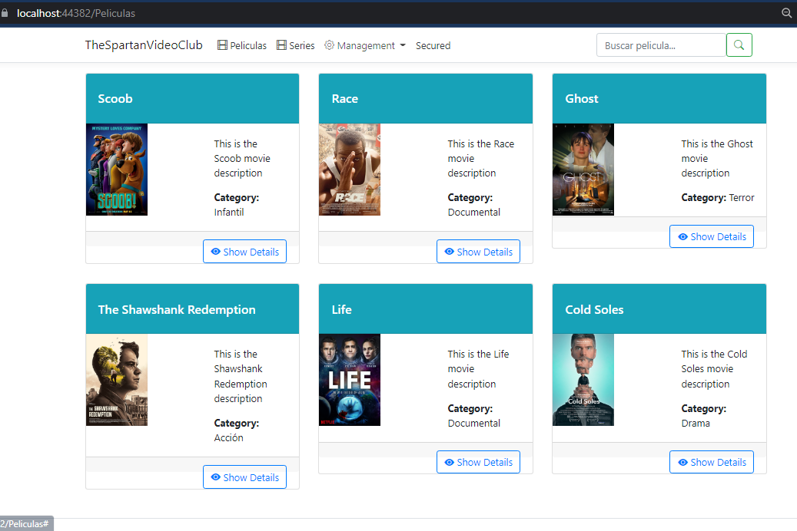
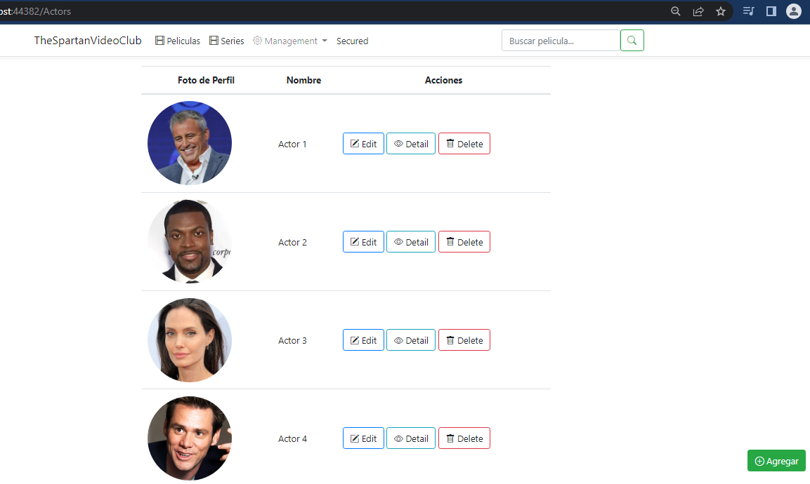
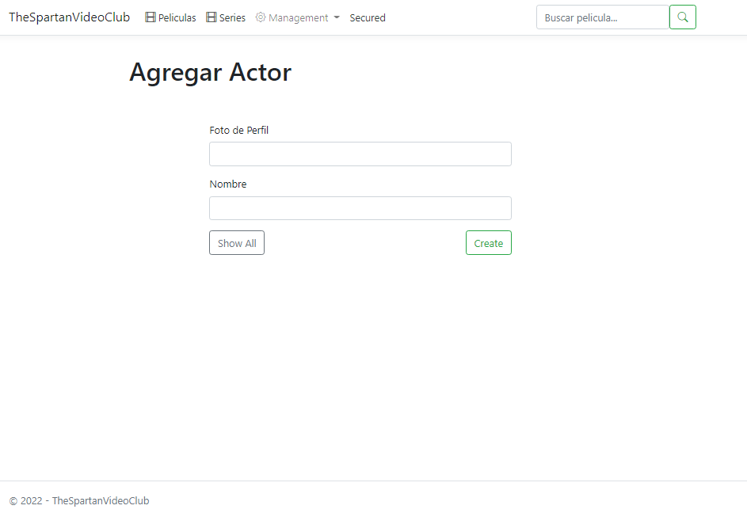
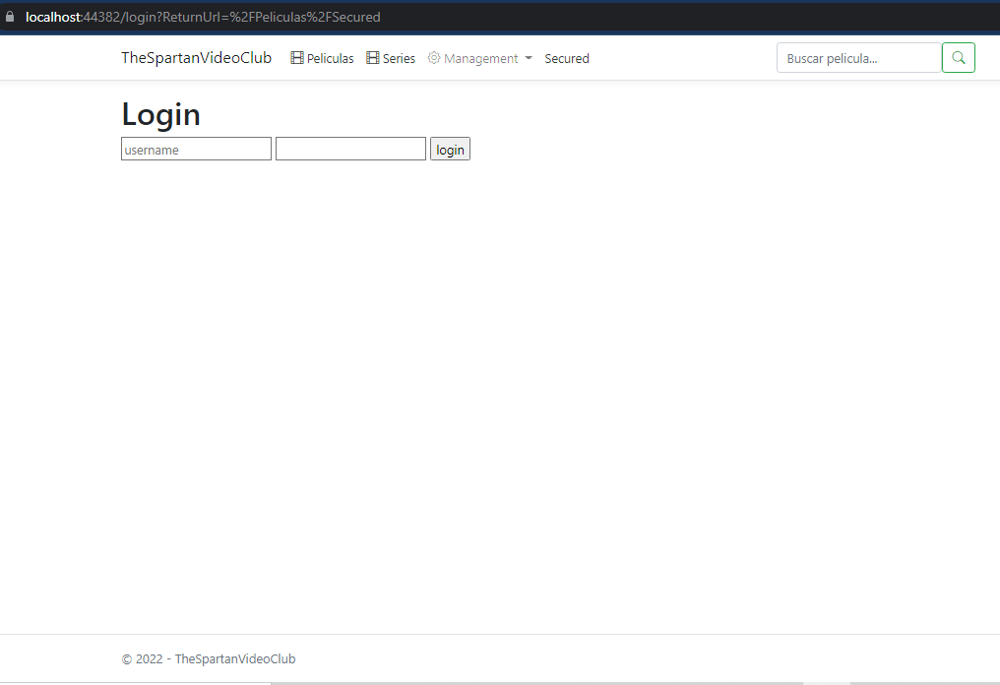

# VideoClubApp
<h1>DOCUMENTACIÓN</h1>
<h3> SECUENCIA DEL PROYECTO </>

-	Crear el proyecto en VSC, el cual ya trae todas las carpetas, la estructura todas y herramientas necesarias para la realización del mismo.

-	Definimos nuestras clases mediante código, y EF se encarga de generar la base de datos y todo lo necesario para encajar las clases en ellas (Code First).

-	Agregar el DbContext  también se conocido como el archivo traductor entre los modelos (clases C#) y el almacenamiento de datos (SQL Server en nuestro caso).

-	Agregar las relaciones de los modelos, estas se utilizan para definir relaciones de tabla en su base de datos.

-	Configurar Sql Server para activar una conexión y de esta forma comunicar la capa de negocios con la base de datos.

-	Agregar la migración de los modelos creados a la base de datos.

-	Insertar datos.

-	Agregar los controladores, uno por cada función, un controlador es una clase de C# que se encarga de controlar la forma en que un usuario interactúa con una aplicación MVC.

-	Agregar las Vistas; una vista es un archivo razor (combinación de C# con HTML) y eso es lo que ve un usuario cuando usa la aplicación. 

-	Agregar las Interfaces; hasta ahora, en nuestra aplicación ASP.NET MVC, hemos inyectado el archivo AppDbContext directamente en el controlador, lo que no es una buena práctica.
En esta etapa se eliminará el código relacionado con los datos de los controladores y utilizará los servicios en su lugar. Las interfaces se usarán para inyectar en los controladores, por lo que de esta manera estamos agregando una capa más de abstracción en nuestra aplicación.

-	Crear Los formularios en ASP.NET MVC, estos se utilizan para proporcionar datos que luego puede almacenar en la base de datos. 
Primero , se diseña el formulario y luego, se agrega el enlace de datos y la validación de datos a este formulario.

-	Autentificar y autorizar, definir los roles : administrador, usuario.

